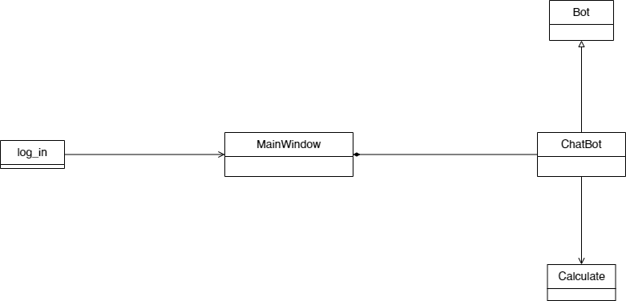

#  ЧатБот по имени Ева
## Умеет:
- /info - информация о всех командах
- /saveon - включить сохранение диалога
- /saveoff - отключить сохранение диалога
- /fileclean - очищение текстового файла
- /loaddialog - загрузить диалог из файла 
- /dollar - курс доллара
- /euro - курс евро
- /weather - погода в городе Чита
- /clear - очистка сообщений в окне
- Вычисли `2 + 2 * 2`
- Сколько время?

```
```
## UML:

